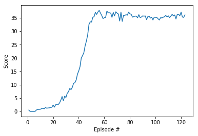

# Continuous control #

In this environment, a double-jointed arm can move to target locations. A reward of +0.1 is provided for each step that the agent's hand is in the goal location. 
Thus, the goal of your agent is to maintain its position at the target location for as many time steps as possible.

The observation space consists of 33 variables corresponding to position, rotation, velocity, and angular velocities of the arm. Each action 
is a vector with four numbers, corresponding to torque applicable to two joints. Every entry in the action vector should be a number between -1 and 1.

## Distributed training ##

The solution to the problem provided in this repository uses a Unity environment version with 20 agents. 

## Solving the environment ##

The environment is considered solved when the agents get an average score of +30 (over 100 consecutive episodes, and over all agents). Specifically,

* After each episode, we add up the rewards that each agent received (without discounting), to get a score for each agent. This yields 20 (potentially different) scores. We then take the average of these 20 scores.
* This yields an average score for each episode (where the average is over all 20 agents).

# Getting started #

1. Follow [these instructions](https://github.com/udacity/deep-reinforcement-learning#dependencies) for installing dependencies 
1. Download the Unity environment:
    1. [Linux](https://s3-us-west-1.amazonaws.com/udacity-drlnd/P2/Reacher/Reacher_Linux.zip)
    1. [MacOS](https://s3-us-west-1.amazonaws.com/udacity-drlnd/P2/Reacher/Reacher.app.zip)
    1. [Windows 32-bit](https://s3-us-west-1.amazonaws.com/udacity-drlnd/P2/Reacher/Reacher_Windows_x86.zip)
    1. [Windows 64-bit](https://s3-us-west-1.amazonaws.com/udacity-drlnd/P2/Reacher/Reacher_Windows_x86_64.zip)
1. Place the unzipped file in the p2_continuous-control/ folder
1. Run the Continuous Control.ipynb notebook - you will need to change the path to the environment 
